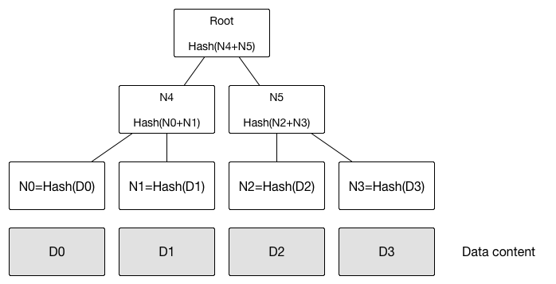
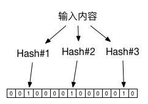

# 区块链技术指南
- 参考于 [区块链技术指南](https://yeasy.gitbooks.io/blockchain_guide/content/)
- [关键问题和挑战](https://yeasy.gitbooks.io/blockchain_guide/content/overview/challenge.html)
## 1. 区块链的诞生
- 实际上，所有跟信息、价值（包括货币、证券、专利、版权、数字商品、实际物品等）、信用等相关的交换过程，都将可能从区块链技术中得到启发或直接受益。
- “黑暗森林”猜疑链，囚徒困境
## 2. 核心技术概览
- 狭义上，区块链是一种以区块为基本单位的链式数据结构，区块中利用数字摘要对之前的交易历史进行校验，适合分布式记账场景下防篡改和可扩展性的需求。
- 广义上，区块链还指代基于区块链结构实现的分布式记账技术，包括分布式共识、隐私与安全保护、点对点通信技术、网络协议、智能合约等。
- 区块链的基本原理理解起来并不复杂。首先来看三个基本概念：
	- 交易（Transaction）：一次对账本的操作，导致账本状态的一次改变，如添加一条转账记录；
	- 区块（Block）：记录一段时间内发生的所有交易和状态结果等，是对当前账本状态的一次共识；
	- 链（Chain）：由区块按照发生顺序串联而成，是整个账本状态变化的日志记录。
- POW Proff of Work，工作量证明，引入一个对特定值的计算工作
- POS Proff of Stake，权益证明
- 从技术角度讲，区块链所涉及到的领域比较繁杂，包括分布式系统、密码学、心理学、经济学、博弈论、控制论、网络协议等，这也意味着工程实践中大量的挑战。
## 4. 分布式系统核心技术
### 一致性问题
- 这些方案背后的思想，都是**将可能引发不一致的并行操作进行串行化**。这实际上也是现代分布式系统处理一致性问题的基础思路。
- 可终止性（Termination）：一致的结果在有限时间内能完成；
- 约同性（Agreement）：不同节点最终完成决策的结果是相同的；
- 合法性（Validity）：决策的结果必须是某个节点提出的提案。
- 从前面的分析可以看到，要实现绝对理想的严格一致性（Strict Consistency）代价很大。除非系统不发生任何故障，而且所有节点之间的通信无需任何时间，此时整个系统其实就等价于一台机器了。实际上，越强的一致性要求往往意味着带来越弱的处理性能，以及越差的可扩展性。根据实际需求的不用，人们可能选择不同强度的一致性，包括强一致性（Strong Consistency）和弱一致性（Weak Consistency）。
### 共识算法
- **The DAO事件，以太坊链存在了分叉**
- 一致性指的是多个副本对外呈现的状态。如前面提到的顺序一致性、线性一致性，描述了多节点对数据状态的共同维护能力。而共识，则特指在分布式系统中多个节点之间对某个事情（例如多个事务请求，先执行谁？）达成一致看法的过程。因此，达成某种共识并不意味着就保障了一致性。
- 根据解决的场景是否允许拜占庭错误情况，共识算法可以分为 Crash Fault Tolerance (CFT) 和 Byzantine Fault Tolerance（BFT）两类。
- 即便在网络通信可靠情况下，一个可扩展的分布式系统的共识问题通用解法的下限是——没有下限（无解）。
### FLP不可能原理
- **不要浪费时间，去试图为异步分布式系统设计面向任意场景的共识算法**。
- 科学告诉你什么是不可能的；工程则告诉你，付出一些代价，可以把它变成可行。科学告诉你去赌场是愚蠢的，因为最终总会输钱；工程则告诉你，如果你愿意接受最终输钱的风险，中间说不定能偶尔小赢几笔呢！
### CAP原理
- 分布式系统中无法同时确保一致性（Consistency）、可用性（Availability）和分区容忍性（Partition），设计中需要弱化对某个特性的需求
#### 弱化一致性
对结果一致性不敏感的应用，可以允许在新版本上线后过一段时间才最终更新成功，期间不保证一致性。
例如网站静态页面内容、实时性较弱的查询类数据库等，简单分布式同步协议如 Gossip，以及 CouchDB、Cassandra 数据库等，都为此设计。
#### 弱化可用性
对结果一致性很敏感的应用，例如银行取款机，当系统故障时候会拒绝服务。MongoDB、Redis、MapReduce 等为此设计。
Paxos、Raft 等共识算法，主要处理这种情况。在 Paxos 类算法中，可能存在着无法提供可用结果的情形，同时允许少数节点离线。
#### 弱化分区容忍性
现实中，网络分区出现概率较小，但很难完全避免。
两阶段的提交算法，某些关系型数据库以及 ZooKeeper 主要考虑了这种设计。
实践中，网络可以通过双通道等机制增强可靠性，实现高稳定的网络通信。
### ACID原则与多阶段提交
- ACID，即 Atomicity（原子性）、Consistency（一致性）、Isolation（隔离性）、Durability（持久性）。
### Paxos 算法与Raft算法
### 拜占庭问题与算法
- 讨论的是允许存在少数节点作恶（消息可能被伪造）场景下的如何**达成共识**问题。
- 对于拜占庭问题来说，假如节点总数为 N，故障节点数为 F，则当 N >= 3F + 1 时，问题才能有解，由 BFT 算法进行保证。
## 5. 密码学与安全技术
### Hash算法与数字摘要
- 正向快速
- 逆向困难
- 输入敏感
- 碰撞避免
### 加解密算法
#### 对称加密
- 流密码，加密和解密均与和明文等长的随机串进行异或处理，也是一次性密码；
#### 非对称加密
- 非对称加密解密要比对称加密解密慢2-3个数量级
- 非对称加密算法的安全性往往基于数学问题，包括大质数因子分解、离散对数、椭圆曲线等经典数学难题。
- RSA
- Diffie-Hellman密钥交换，基于离散对数无法快速求解，可以在不安全的通道上，双方协商一个公共密钥
- Elgamal，利用了模运算下求离散对数困难的特性
- 椭圆曲线算法（Elliptic Cruve Cryptography, ECC），基于椭圆曲线上特定点进行特殊乘法逆运算难以计算的特性。
- SM2，中国国家商用密码系列算法标准，同样基于椭圆曲线算法
##### 选择明文攻击
- 可以通过同样的明文，生成完全不同的结果来避免。
- 在实现上可以有多种思路。一种是对明文先进行变形，添加随机的字符串或标记，再对添加后结果进行处理。另外一种是先用随机生成的临时密钥对明文进行对称加密，然后再将对称密钥进行加密，即利用多层加密机制。
#### 混合加密机制
- 非对称加密传输生成的对称加密的密钥，使用对称加密解密进行会话
- 前向安全性，对每次会话生成不同的对称加密密钥，避免某次密钥的泄漏影响其它会话的安全
#### 离散对数与Diffie–Hellman 密钥交换协议

	DH协议如下:
    1.选择两个素数 p,g 
    2.选择整数x，计算X=g^x mod p
    3.选择整数y，计算Y=g^y mod p
    4.共同密钥 Z = X^y mod p
    5.共同密钥 Z = Y^x mod p

#### 默克尔树

- 最下面的叶节点包含存储数据或其哈希值。
- 非叶子节点（包括中间节点和根节点）都是它的两个孩子节点内容的哈希值。
- 快速比较大量数据
- 快速定位修改
##### 零知识证明
- 仍以上图为例，如何向他人证明拥有的某组数据（D0……D3）中包括给定某个内容 D0 而不暴露其它任何内容。
- 很简单，构造如图所示的一个默克尔树，公布 N1，N5，Root。验证者计算 Root 值，验证是否跟提供值一致，即可很容易检测 D0 存在。整个过程中验证者无法获知其它任何信息。
#### Bloom Filter 结构

- 布隆过滤器是一种基于 Hash 的高效查找结构，能够快速（常数时间内）回答“某个元素是否在一个集合内”的问题。
- 布隆过滤器采用了多个 Hash 函数来提高空间利用率。
- 布隆过滤器在应用中误报率往往很低，例如，在使用 7 个不同 Hash 函数的情况下，记录 100 万个数据，采用 2 MB 大小的位串，整体的误判率将低于 1%。而传统的 Hash 查找算法的误报率将接近 10%。
#### 同态加密
- 同态加密（Homomorphic Encryption）是一种特殊的加密方法，允许对密文进行处理得到仍然是加密的结果。即对密文直接进行处理，跟对明文进行处理后再对处理结果加密，得到的结果相同。从抽象代数的角度讲，保持了同态性。
##### 函数加密
- 与同态加密相关的一个问题是函数加密。
- 同态加密保护的是数据本身，而函数加密顾名思义保护的是处理函数本身，即让第三方看不到处理过程的前提下，对数据进行处理。
- 该问题已被证明不存在对多个通用函数的任意多密钥的方案，目前仅能做到对某个特定函数的一个密钥的方案。