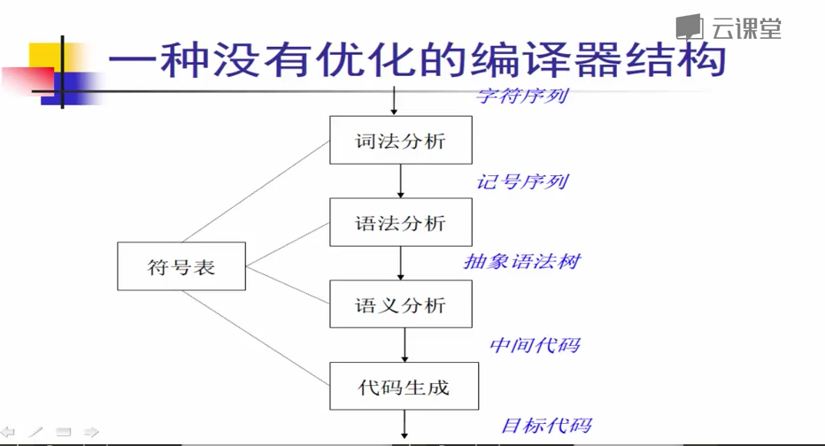
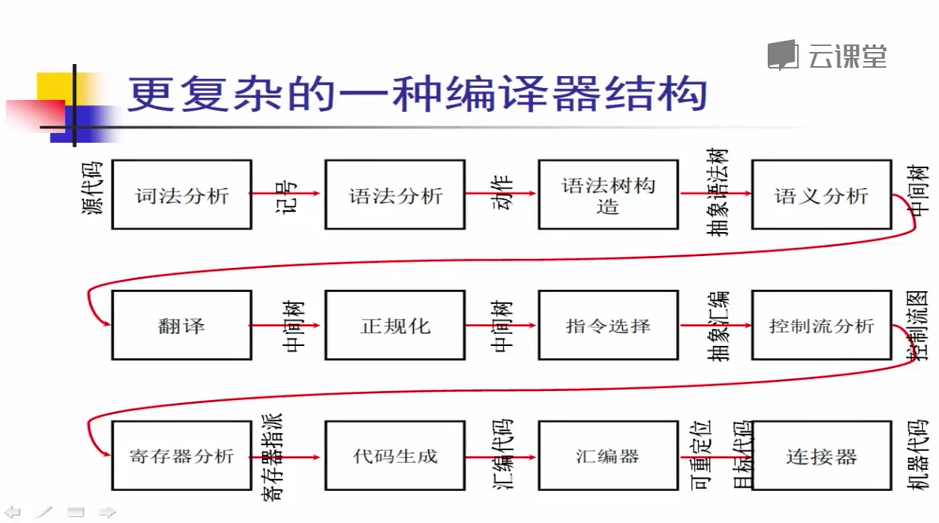
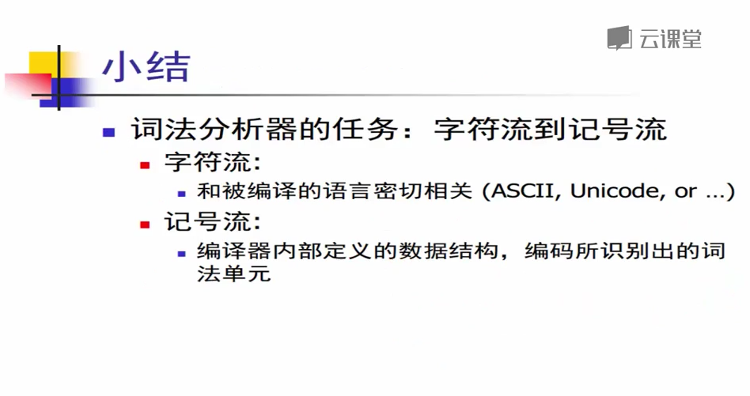
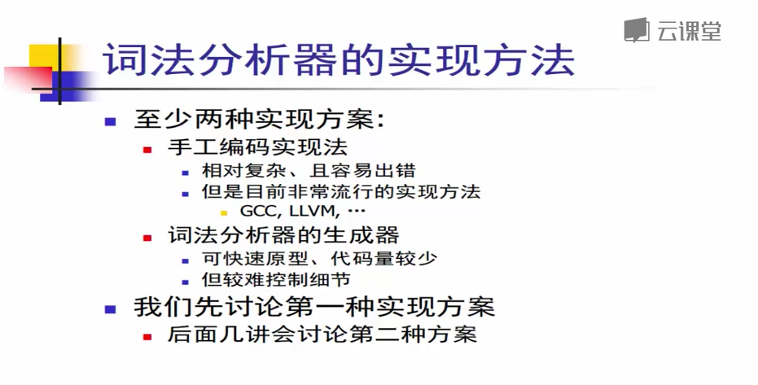
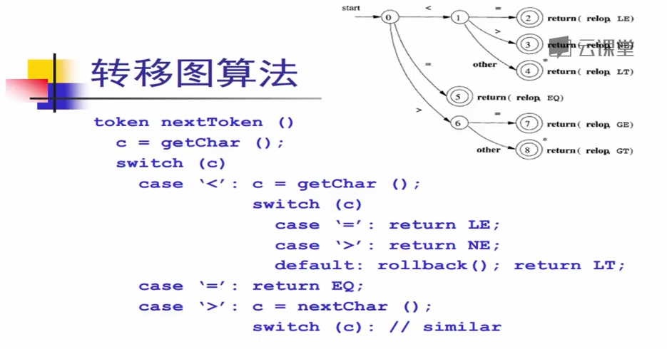
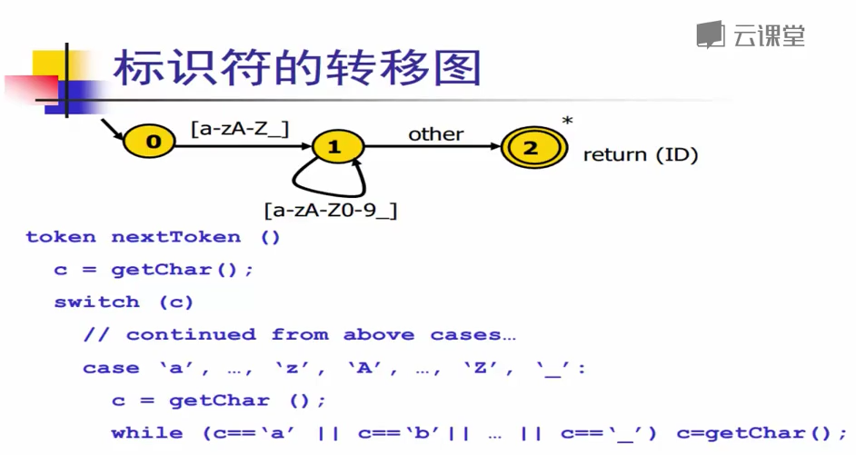
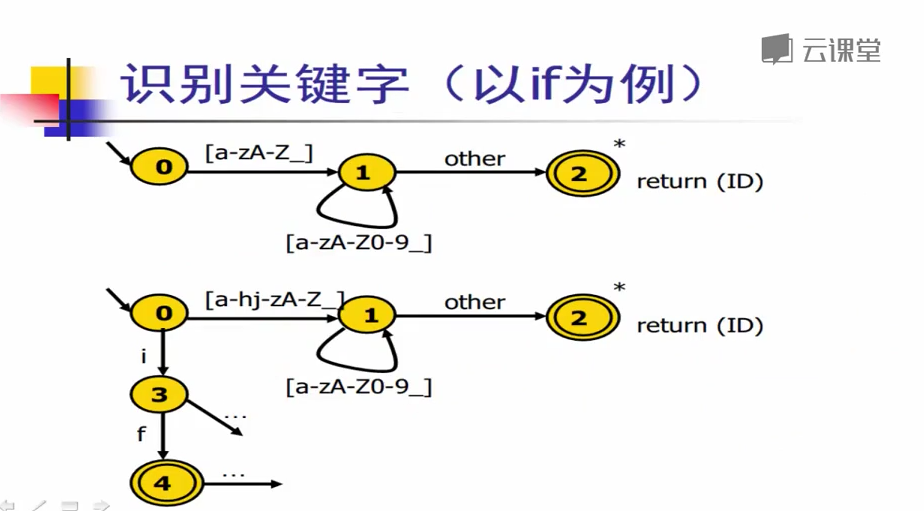
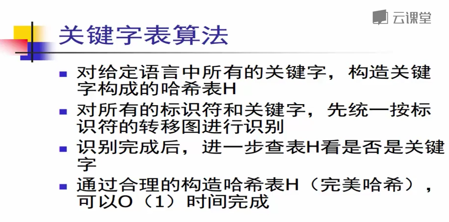

# 编译原理
## 1. 编译器概述
#### 为什么学习编译原理
- 编译原理集中体现了计算机科学的很多核心思想：算法，数据结构，软件工程等
- 编译器是其它领域的重要研究基础
- 编译器本身就是非常重要的研究领域：新的语言设计，大型软件的构造和维护
#### 编译器的高层结构
- 编译器具有非常**模块化**的高层结构
- 可看成多个阶段构成的“流水线”结构：一层一层降低抽象，也使模块可维护

## 2. 词法分析

### 手工构造词法分析器
#### 构造转移图

- 需注意，语言的关键字和标识符有交集，从词法分析角度来看，关键字是标识符的一部分

#### 使用关键字表区分关键字与标识符

### 正则表达式
- 正则表达式 >> 自动机 >> 算法
- 用正则表达式来阐述语法的规则
- 图灵机只需要两个运算就能完成所有操作：赋值和跳转
### 有限状态自动机
- 工具：flex

## 10. 代码优化概述
- 代码优化是对被优化的程序进行的一种**语义保持**的变换，程序的**可观察行为(I/O, File, Network)**不能改变
- 使程序更小、更快、cache行为更好、更节能等等
- 不存在**"完全优化"**，等价与"停机问题"
- 编译优化是无止境的，“编译器从业者用不失业定理”
#### 代码优化很困难
- 不能保证优化总能产生“好”的结果
- 优化的顺序和组合很关键
- 很多优化问题是非确定的
- 优化的正确性论证很微妙
